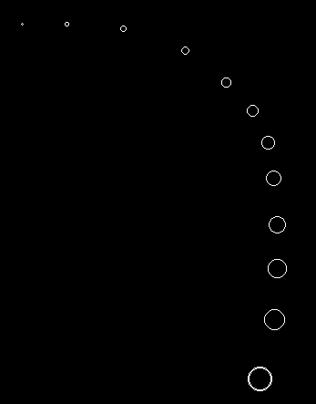



## Mouse Snake

### Description

Have you ever seen it in a program? A long snake that is following your mouse pointer. Here is the code. PLEASE VOTE FOR ME!!!
 
### More Info
 

             |
---                |---
**Submitted On**   |2000-07-27 16:39:48
**By**             |[Druid Developing](https://github.com/Planet-Source-Code/PSCIndex/blob/master/ByAuthor/druid-developing.md)
**Level**          |Beginner
**User Rating**    |4.9 (69 globes from 14 users)
**Compatibility**  |VB 5\.0, VB 6\.0
**Category**       |[Graphics](https://github.com/Planet-Source-Code/PSCIndex/blob/master/ByCategory/graphics__1-46.md)
**World**          |[Visual Basic](https://github.com/Planet-Source-Code/PSCIndex/blob/master/ByWorld/visual-basic.md)
**Archive File**   |[CODE\_UPLOAD82397272000\.zip](https://github.com/Planet-Source-Code/druid-developing-mouse-snake__1-10126/archive/master.zip)

